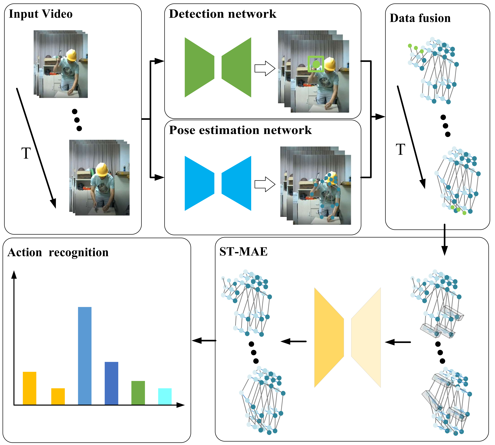
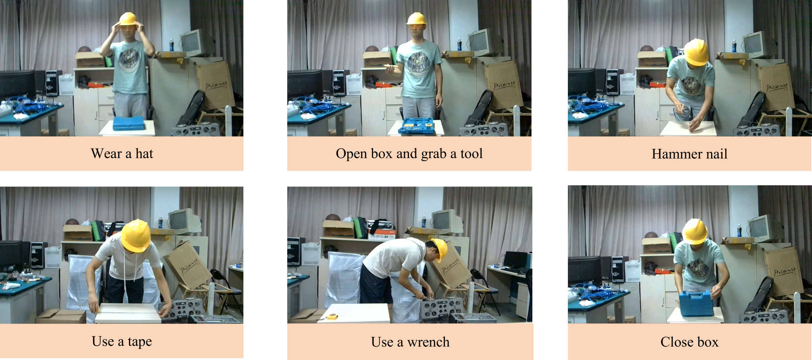

# ST-MAE
Information
===========
This is the warehouse for the ST-MAE project, which is a network committed to action recognition for solving similar actions of workers in intelligent factories.
A dataset with eight worker actions that are commonly conducted in intelligent factory assembly tasks is collected to evaluate our method. The experimental results demonstrate the effectiveness and advantages of our method compared to the state-of-the-art action recognition methods.

## About worker actions (WA) datasets
We select eight typical worker actions that are common in intelligent assembly tasks: wearing a hat (WH), opening a box to get a tool (OB), hammering a nail (HN), using tape (UT), using a wrench (UW), closing a box (CB), picking up and dropping a workpiece (PDW), and moving a box (MB). 

#### Dataset contents
RGB image and worker skeleton information for each frame.
#### Data Acquired
The dataset is conveniently available here.

## Code Acquired
Follow-up will soon be easily accessible.
